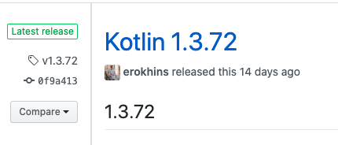
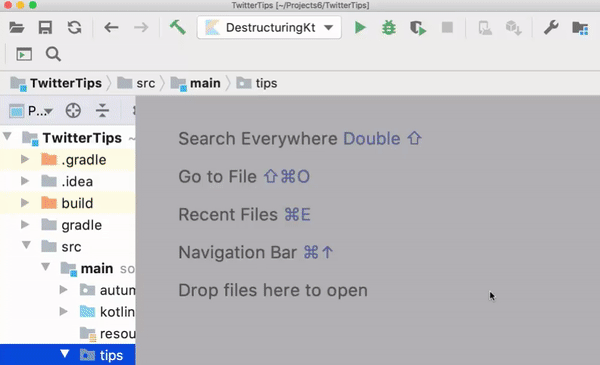
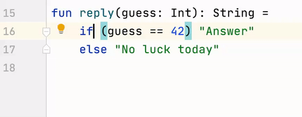

# Kotlin Meetup Abril 2020

## Charlas 

### Gastón Saillen
_Android Developer_

[**Introducción a Firebase y casos de uso**]()

Vamos a explorar Firebase con sus distintas herramientas y vamos a ver como es aplicable a una app en Android para manejar nuestro backend. Vamos a charlar sobre datos en tiempo real, buenas prácticas de diseño, push notifications, crashlytics , analytics, funciones y mucho más!

##

### Lucas Nobile
_Senior Android Developer en Distillery_

[**Kotlin Snippets FTW (For the Win)**]()

Revisamos un conjunto de Kotlin snippets que podemos usar diariamente y que todo Android dev necesita conocer.

##

### Mauro Bocanegra
_Senior Android Developer en Distillery_

[**Please KNo!**]()

Cosas que debemos de evitar en Kotlin, Malas y peores prácticas y todo lo que no debe pasar en nuestro código Android.

## Kotlin Resources

### [Building a Hash Map in Kotlin](https://medium.com/swlh/building-a-hash-map-in-kotlin-73c9b23d19ba)

](resources/kt_hashmap.png)

### [Safely Launch Exception-Ready Coroutines](https://medium.com/swlh/safely-launch-exception-ready-coroutines-31804de77993)

](resources/safelycoroutines.png)

### [Kotlin Koin Scope Illustrated](https://medium.com/@elye.project/kotlin-koin-scope-illustrated-3bfa6c7ae98)

](resources/koin_scope.jpg)

##

### [Kotlin 1.3.72](https://github.com/JetBrains/kotlin/releases/tag/v1.3.72) 

### [Building a Full Stack Web App with Kotlin Multiplatform](https://play.kotlinlang.org/hands-on/Full%20Stack%20Web%20App%20with%20Kotlin%20Multiplatform/01_Introduction?utm_source=kotlin&utm_medium=twitter&utm_campaign=April_22)

<blockquote class="twitter-tweet">
Learn how to build a full-stack web application with a Kotlin/JVM server and a Kotlin/JS client and explore topics dealing with multiplatform code sharing, serialization, and server-side and client-side development in our newest hands-on: <a href="https://t.co/3wt5h4isSg">https://t.co/3wt5h4isSg</a>
&mdash; Kotlin (@kotlin) <a href="https://twitter.com/kotlin/status/1252886862424952832?ref_src=twsrc%5Etfw">April 22, 2020</a></blockquote> 

### Better copy and paste

<blockquote class="twitter-tweet">
Want to add some code to your project? You don’t need to create a file for it first. Just copy the code, select the folder in the Project View in IntelliJ IDEA or Android Studio where you want to have it, and paste it. The IDE will automatically create a file for you. <a href="https://twitter.com/hashtag/KotlinTips?src=hash&amp;ref_src=twsrc%5Etfw">#KotlinTips</a> <a href="https://t.co/fWNEbOXUKu">pic.twitter.com/fWNEbOXUKu</a>
&mdash; Kotlin (@kotlin) <a href="https://twitter.com/kotlin/status/1249993403292618754?ref_src=twsrc%5Etfw">April 14, 2020</a></blockquote>

### If/Else -> when

<blockquote class="twitter-tweet">
Are the two branches of your if-else statement no longer enough? Transform your existing conditions into a more versatile when statement by using the intention &quot;Replace &#39;if&#39; with &#39;when&#39;&quot; <a href="https://twitter.com/hashtag/KotlinTips?src=hash&amp;ref_src=twsrc%5Etfw">#KotlinTips</a> <a href="https://t.co/DenDoQYaTf">pic.twitter.com/DenDoQYaTf</a>
&mdash; Kotlin (@kotlin) <a href="https://twitter.com/kotlin/status/1252530100798722049?ref_src=twsrc%5Etfw">April 21, 2020</a></blockquote> 
