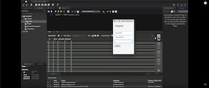
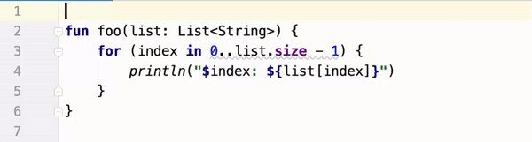
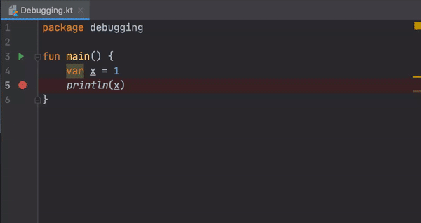

# Kotlin Meetup Febrero 2020

## Charlas 

### Dinorah Tovar
_Mobile Engineer en Konfio_

[**Kotlin DSL: Modularizacion en proyectos**](resources/DSLKotlin.pdf)

En esta plática hablaremos de Domain specific language y como podemos usarlo en nuestro Gradle para manejar proyectos con múltiples módulos de manera sencilla y eficaz, haciendo incapie en Imperative code

##

### Diego Ramirez
_Senior Android Developer en Distillery_

[**Channels Kotlin**](https://docs.google.com/presentation/d/1t-ap1v8leDXcGkMC20o6_uLS6MfoOktvEBAfOCNVIqI/edit?usp=drivesdk)

En esta platica vamos a hablar sobre Coroutine Channels y los distintos tipos de canales para transmisión de datos, entender como el emisor y el receptor funcionan dependiendo el tipo de channel y tal vez podamos dejar sin memoria a un dispositivo.

## Kotlin Resources

[From RxJava to Kotlin Flow: Stream Types](https://proandroiddev.com/from-rxjava-to-kotlin-flow-stream-types-7916be6cabc2)

Create a Login and Register TornadoFX with MySQL

##

Use _indices_ property ;) 

<blockquote class="twitter-tweet">
Use the &#39;list.indices&#39; property instead of building an explicit range using &#39;0..list.length-1&#39; or &#39;0 until list.length&#39;. Iterating over all such ranges is optimized, so no additional IntRange objects for storing indexes are created under the hood. <a href="https://twitter.com/hashtag/KotlinTips?src=hash&amp;ref_src=twsrc%5Etfw">#KotlinTips</a> <a href="https://t.co/KAfOGpWPfM">pic.twitter.com/KAfOGpWPfM</a>
&mdash; Kotlin (@kotlin) <a href="https://twitter.com/kotlin/status/1232251425868128257?ref_src=twsrc%5Etfw">February 25, 2020</a></blockquote>

Debugging in realtime

<blockquote class="twitter-tweet">
When debugging, you can modify the variable value directly: <a href="https://twitter.com/hashtag/KotlinTips?src=hash&amp;ref_src=twsrc%5Etfw">#KotlinTips</a> <a href="https://t.co/48itDVZ6zg">pic.twitter.com/48itDVZ6zg</a>
&mdash; Kotlin (@kotlin) <a href="https://twitter.com/kotlin/status/1204294840789303296?ref_src=twsrc%5Etfw">December 10, 2019</a></blockquote>
