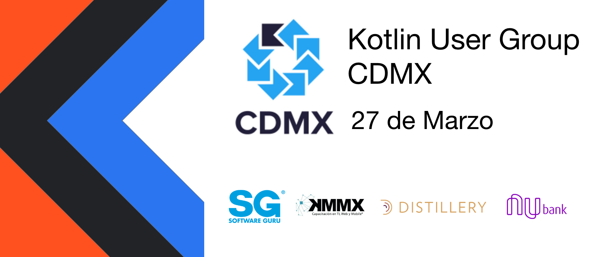

# Kotlin Meetup Marzo 2020

## Charlas 

### [ Eddú Meléndez ]
_Software Engineer en Nubank_

[**Consumer Driven Contract Testing con Spring Cloud Contract**](resources/slide)

En plena era de microservicios, escribir pruebas puede sonar sencillo ya que nos hacemos 
responsables de solo un dominio. Pero, en el mundo real, las pruebas de los microservicios 
pueden ser duras. En esta sesión, veremos cómo CDC Testing nos ayuda a mantener nuestros 
servicios trabajando juntos. Estaremos explorando el proyecto Spring Cloud Contract 
haciendo uso de Kotlin DSL.

## Kotlin Resources

[From RxJava to Kotlin Flow: Stream Types](https://proandroiddev.com/from-rxjava-to-kotlin-flow-stream-types-7916be6cabc2)

Create a Login and Register TornadoFX with MySQL

##

Kotlin 1.3.70 released!!!

<blockquote class="twitter-tweet">
We’ve just released Kotlin 1.3.70! Learn all about the new experimental functionality in the standard library and other improvements in our latest blog post <a href="https://t.co/jlyThHFgmb">https://t.co/jlyThHFgmb</a> <a href="https://t.co/md7Eqa5rLv">pic.twitter.com/md7Eqa5rLv</a>
&mdash; Kotlin (@kotlin) <a href="https://twitter.com/kotlin/status/1234917943970009090?ref_src=twsrc%5Etfw">March 3, 2020</a></blockquote>

